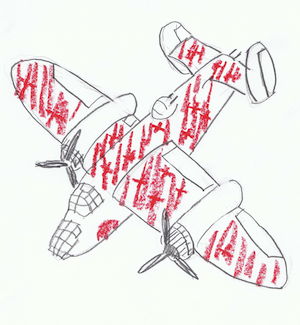

class: center, middle
# There are 10 kinds of people in this world. 
# Those that understand binary and those that don’t.

---

class: left, middle
# Teemo Tebest
* atk-toimittaja, datajournalisti, ihminen.
* Taustaa...
* <a href="http://teelmo.info">teelmo.info</a>, kotisivut.
* <a href="http://datajournalismi.blogspot.com">datajournalismi.blogspot.com</a>, blogi.
* <a href="http://twitter.com/teelmo">@teelmo</a> mm. Twitter.

---

class: center, middle
# PlusDesk

Sisältöjä yhteistyössä toimittajien kanssa.

  
  
  
  

  
  
  

---

class: center, middle
# Lusin koodarit?
Onko heitä…

---

class: left, middle
# Verkonomaisia esimerkkejä

Taulukko, Laskuri, Testi, Datakäyttöliittymä, Featurejuttu, Palvelu, Analytiikka, Verkkokokonaisuudet

---

class: left, middle
# Taulukko
Haettava ja järjestettävä taulukko

* <a href="http://yle.fi/uutiset/lukioiden_ranking-lista_julki__katso_miten_oma_koulusi_sijoittui/7258451">Ylioppilaat</a>
* <a href="http://yle.fi/aihe/artikkeli/2015/06/30/vinkkeja-autokoulun-valintaan-lapimenoprosentit-vaihtelevat">Autokoulut</a>

---

class: left, middle
# Laskuri
Tarkastelu omasta näkökulmasta

* <a href="http://yle.fi/aihe/artikkeli/2015/12/18/katso-mita-maksat-yhteiskunnalle">Kallis elämä</a>
* <a href="http://yle.fi/uutiset/6544401">Leikkauslaskuri</a>
* <a href="http://yle.fi/uutiset/8656874">Sähkönhintakartta</a>

---

class: left, middle
# Testi

Juttu puettu testin muotoon.

* <a href="http://yle.fi/aihe/artikkeli/2014/10/12/testaa-millainen-sinusta-tulee-vanhana">Vanhustesti</a>
* <a href="http://yle.fi/aihe/artikkeli/2016/01/25/umk16-tietaja-tee-pikatesti">UMK-testi</a>
* <a href="http://yle.fi/aihe/artikkeli/2014/11/06/oletko-talvisotatietaja-testaa-tietosi">Talvisotatesti</a>
* <a href="http://yle.fi/aihe/artikkeli/2015/10/31/testi-onko-sinussa-ainesta-bondiksi">Bond-testi</a>
* <a href="http://yle.fi/aihe/artikkeli/2015/10/16/maakuntaviikon-heimotesti">Heimotesti</a>
* <a href="http://yle.fi/uutiset/luulitko_olevasi_suomalainen_testaa/7207292">Suomalaisuustesti</a>, <a href="https://www.youtube.com/watch?v=nAHeihbb6ak">TV</a>

---

class: left, middle
# Äänestys

Leikkimieliset äänestykset.

*<a href="http://yle.fi/aihe/misc/144487">Sibelius viulukilpailu</a>
*<a href="http://yle.fi/uutiset/edustiko_vaara_viisu_jalleen_suomea__aanesta_kautta_aikain_kaltoin_kohdelluin_viisuehdokas/7807923">Euroviisuäänestys</a>

---

class: center, middle
# Tauko!

Jaffaa…

---

class: left, middle
# Desktop vs. mobiili

* Mobiilin osuus kasvaa
* Desktopille voi silti tehdä näyttävää
* Mikä olisi mobiili wow?

---

class: left, middle
# Verkkosivut vs. some

* Julkaisu natiivisti suoraan someen
* Somen rooli tärkeä näkyvyydessä
* Video on nyt hot, mitä seuraavaksi?

---

class: left, middle
# Datakäyttöliittymä

Datan selailuun rakennettu käyttöliittymä.

* <a href="http://yle.fi/uutiset/7148743">Rakennemuutoslaskuri</a>
* <a href="http://yle.fi/uutiset/8416491">Tulokone</a>, <a href="https://twitter.com/vjuutilainen/status/659979855128338432">Twitter</a>, <a href="https://www.youtube.com/watch?v=8cgkw3urSok">TV</a>

---

class: left, middle
# Feature-juttu
    
Visuaalisuusvetoinen tarina.

* <a href="http://yle.fi/uutiset/he_valvovat_rajojamme__tervetuloa_tyovuoroon_itarajalle/7971896">Itä-Rajalla</a>
* <a href="http://yle.fi/aihe/he_katsovat_kuolemaa_silmiin">He Katsovat Kuolemaa Silmiin</a>
* <a href="http://yle.fi/uutiset/7657536">Tampereen tunneli</a>
* <a href="http://yle.fi/uutiset/8502878">Fifa skandaali</a>

---

class: left, middle
# Palvelu
    
Erillinen tarkoitukseen rakennettu palvelu.

* <a href="http://yle.fi/uutiset/7853653">Vanhusvahti</a>
* <a href="http://yle.fi/uutiset/7869067">Kandideitti</a>

---

class: left, middle
    
# Verkkokokonaisuudet
    
Verkkokokonaisuuksien rikastuttaminen

* <a href="http://yle.fi/plus/other/2015_mhl_seksikoulu/">MHL – seksikoulu</a>
* <a href="http://yle.fi/plus/other/2015_mhl_sanapilvi/">MHL – sanapilvi</a>
* <a href="http://yle.fi/plus/other/2015_mhl_sanapilvi/">Docventures – faktageneraattori</a>
* <a href="http://yle.fi/plus/other/2016_battlelaskuri/">Battle – laskuri</a>

---

class: left, middle
# Analytiikka
    
Analytiikka on (toimittajan) työväline.

* <a href="http://datajournalismi.blogspot.fi/2015/04/yli-2-miljoonaa-swaippausta-kandideitti.html">Kandideitti oli niche-menestys.</a>
* <a href="http://datajournalismi.blogspot.fi/2015/02/ohjeilla-on-valia.html">Reagointi kannattaa</a>

---

class: left, middle
# Abraham Wald

* Unkarilainen matemaatikko.
* Työskenteli Britannian ilmavoimissa 2. maailman sodan aikana.
* Ongelma: miten vahvistaa pommikoita, jotta ne olisivat kestävämpiä.

---

class: left, middle
Abraham Wald
    

---

class: center, middle 
# Kiitti!
    
 

@teelmo