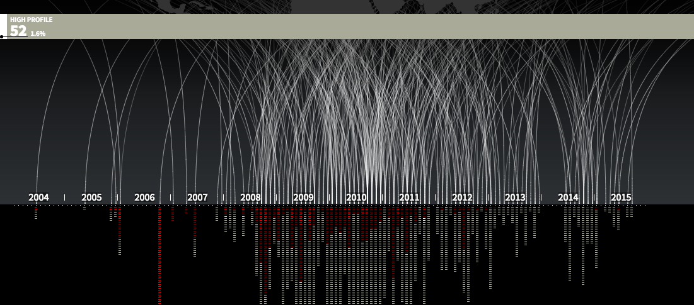
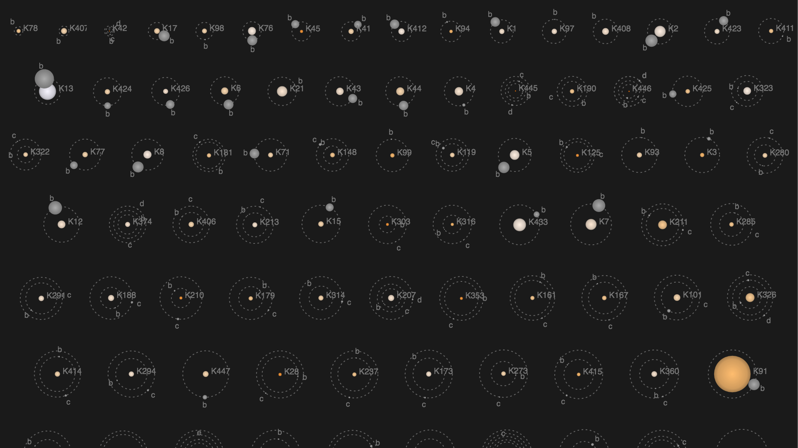
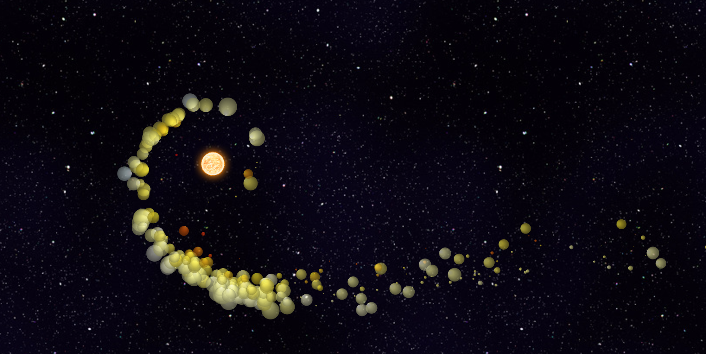
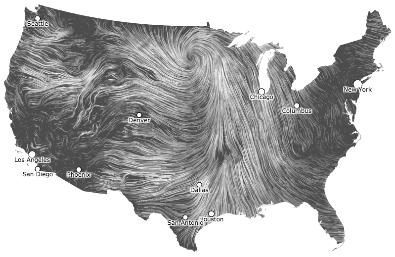
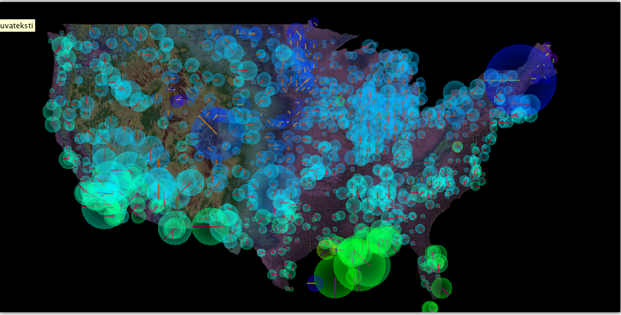
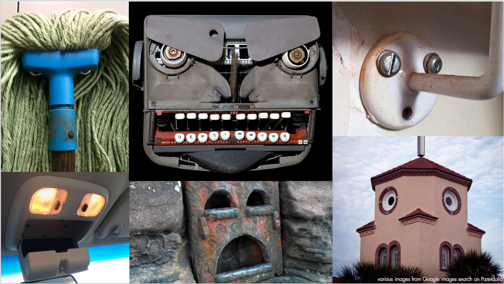

class: left, top
# Teemo Tebest, Yle

* atk-toimittaja, datajournalisti, ihminen.</li>
* <a href="http://teelmo.info" target="_blank">teelmo.info</a>, kotisivut.
* <a href="http://datajournalismi.blogspot.com" target="_blank">datajournalismi.blogspot.com</a>, blogi.
* <a href="http://twitter.com/teelmo" target="_blank">@teelmo</a> mm. Twitter.

Moi taas!

---

# Kerrataan hieman

* <a href="http://yle.fi/uutiset/3-8588611" target="_blank">Taulukko</a>
* <a href="http://yle.fi/uutiset/3-7148743" target="_blank">Viiva- ja ympyrädiagrammi</a>
* <a href="http://yle.fi/uutiset/3-8416491" target="_blank">Kartta- ja pylväsvisualisointi</a>
* <a href="http://yle.fi/uutiset/3-7593350" target="_blank">Infografiikka</a>

---

# Mitä muuta?

* <a href="https://www.youtube.com/watch?v=uElz3xn-GAU" target="_blank">Verkostovisualisoinnit</a>
* <a href="http://bl.ocks.org/jasondavies/1341281" target="_blank">Parallel coordinates</a>
* <a href="http://bl.ocks.org/mbostock/raw/4060606/" target="_blank">Koropleettikartta</a>
* <a href="http://other.yle.fi/2016_ylenbudjetti/" target="_blank">Puudiagrammi</a>
* <a href="https://bost.ocks.org/mike/nations/" target="_blank">Gapminder</a>

---

# Tiedon visualisointi

* <a href="https://docs.google.com/spreadsheets/d/1u-5QOLup78j_QeEsIU0Uptm4dr-qWdSr_fMKjj2vDfw/edit?usp=drive_web" target="_blank">Data</a> 
* Informaatio
* Tietämys
* Ymmärrys

Mihin journalismi asettuu?

---

class: center, middle

# Jaloitellaan

---

class: center, middle

---

class: center, middle

---

class: center, middle

---

class: center, top

# Prosessi

Data, informaatio, tietämys, ymmärrys

Mihin journalismi asettuu?

---

class: center, middle
# Harjoitus

Keksikää mahdollisimman monta tapaa visualisoida luku 75 ja 37. Hahmotelkaa paperille.

Aikaa 10 minuuttia

---

class: center, middle

# Joitain esimerkkejä

---

# Hahmolait

* Similarity (Samanlaisuus)
* Proximity (Läheisyys)
* Symmetry (Symmetria)
* Closure (Sulkeutuvuuden)

<a href="http://www.mit.jyu.fi/opetus/opinnayte/LuK/Hahmolait/#TOC15" target="_blank">Ryhmittely kokonaisuuksiin</a>

Jan Willen Tulp s. 96 

<a href="http://yle.fi/uutiset/3-8416491" target="_blank">Harjoitustehtävä</a>

---

class: center, middle

---

class: center, middle

---

class: center, middle

---

class: center, middle

---

# Harjoitus

Keksikää vähintään viisi data- tai visualisointivetoista juttuideaa.

Aikaa 10 minuuttia.

---

# Harjoitus

Valitkaa aiheista yksi ja keksikää aiheesta viisi kysymystä.

* Mitä
* Mistä
* Miten
* Kuka

Aikaa 10 minuuttia.

---

# Harjoitus

Muodostakaa kolmen hengen ryhmiä, myykää aiheenne toisillenne.

Kahden minuutin hissipuhe!

Aikaa 10 minuuttia.

---

# Harjoitus

Valitkaa aiheista yksi, hahmotelkaa paperille prototyyppi siitä mitä olisitte tekemässä.

Käydään lopuksi läpi mitä saitte aikaan.

* Kenelle tämä tehdään
* Miksi miksi tämä on tärkeää

Aikaa 20–30 minuuttia.

---

class: left, top
# Abraham Wald

* Unkarilainen matemaatikko.
* Työskenteli Britannian ilmavoimissa 2. maailman sodan aikana.
* Ongelma: miten vahvistaa pommikoita, jotta ne olisivat kestävämpiä.

---

class: center, middle
# Abraham Wald

---

class: center, middle

# Kiitos

<a href="http://twitter.com/teelmo" target="_blank">@teelmo</a>

---

class: center, middle

Harjoitukset lainattu <a href="http://tulpinteractive.com/" target="_blank">Jan Willen Tulp</a>.
