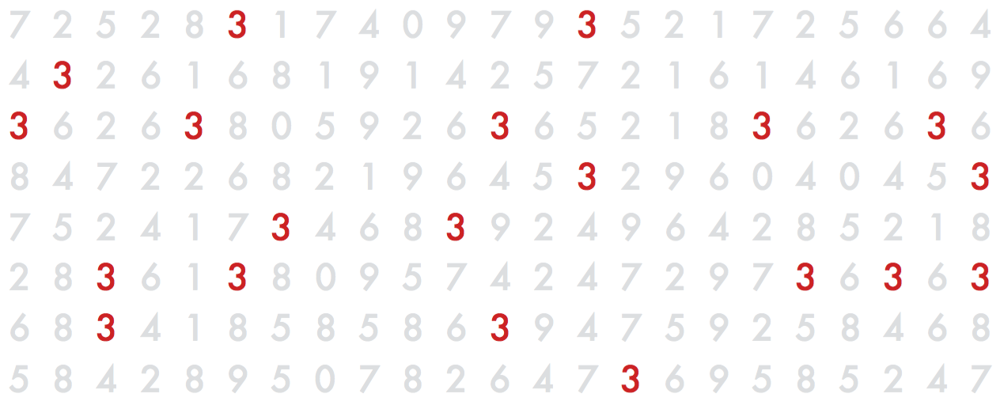
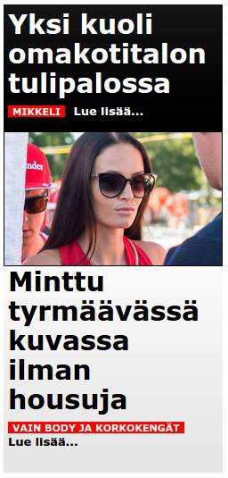

class: left, top
# Teemo Tebest, Yle

* atk-toimittaja, datajournalisti, ihminen.</li>
* <a href="http://teelmo.info" target="_blank">teelmo.info</a>, kotisivut.
* <a href="http://datajournalismi.blogspot.com" target="_blank">datajournalismi.blogspot.com</a>, blogi.
* <a href="http://twitter.com/teelmo" target="_blank">@teelmo</a> mm. Twitter.

---

class: center, top
# PlusDesk

Sisältöjä yhteistyössä muiden toimittajien kanssa.
  

  
  
  
  

  
  
  

## 2 koodaria, 3 graafikkoa, 2 tuottajaa

---

class: left, top
# Mitä teemme?

* Verkkoa
* Kerromme tarinoita
* Dataan perustuvaa journalismia
* Visualisointeja
* Käyttöliittymiä
* Kokeilemme uusia teknologioita, kuten VR

---
# Miten opettaa (data)journalismia?

Käydään keskustellen läpi seuraavia teemoja

* Miksi datajournalismia?
* Mistä dataa saa?
* Miten visualisoida dataa?
* Miten datajournalismia tehdään?
* Mitä datajournalismiin liittyy? 
* Käydään läpi esimerkkejä ja työtapoja

---
class: center, middle

# Mutta mitä on datajournalismi?

Terminä vaikea, data eli tieto ja journalismi.

* Verkkojournalismia
* Data-analyysia
* Tilastotiedettä
* Graafisia taitoja
* Koodamista?
* Tietokantoja?
* Matematiikkaa
* Journalismia?
* Testit, laskurit, "snowfall"-jutut…

---

class: center, middle
# Montako kolmosta kuvassa?

---

class: center, middle

# 20

---

# Miksi datajournalismia?

Ainutlaatuista journalismia!

* <a href="http://yle.fi/uutiset/3-9192528" target="_blank">Kuntatutka</a>

---

# Mistä dataa saa?

* <a href="http://tilastokeskus.fi/" target="_blank">Tilastokeskus</a>
* <a href="https://www.sotkanet.fi/sotkanet/fi/index" target="_blank">THL:n SotkaNET</a>
* <a href="http://www.kunnat.net/fi/Kuntaliitto/Sivut/default.aspx" target="_blank">Kuntaliitto</a>
* <a href="http://www.hri.fi/fi/" target="_blank">HRI</a>
* <a href="http://ec.europa.eu/eurostat" target="_blank">Eurostat</a>
* Google
* <a href="http://www.finlex.fi/fi/laki/ajantasa/1999/19990621" target="_blank">Julkisuuslaki</a>

---

# Miten visualisoida dataa?

* <a href="http://yle.fi/uutiset/3-8588611" target="_blank">Taulukko</a>
* <a href="http://yle.fi/uutiset/3-9177497" target="_blank">Ympyrädiagrammi</a>
* <a href="http://yle.fi/uutiset/3-7148743" target="_blank">Viiva- ja ympyrädiagrammi</a>
* <a href="http://yle.fi/uutiset/3-8416491" target="_blank">Kartta- ja pylväsvisualisointi</a>
* <a href="http://yle.fi/uutiset/3-7593350" target="_blank">Infografiikka</a>
* <a href="http://yle.fi/uutiset/3-9093378" target="_blank">Ryhmittely</a>

---

# Mitä muuta?

* <a href="http://bl.ocks.org/mbostock/raw/4060606/" target="_blank">Koropleettikartta</a>
* <a href="http://other.yle.fi/2016_ylenbudjetti/" target="_blank">Puudiagrammi</a>
* <a href="https://www.youtube.com/watch?v=uElz3xn-GAU" target="_blank">Verkostovisualisoinnit</a>
* <a href="http://bl.ocks.org/jasondavies/1341281" target="_blank">Parallel coordinates</a>
* <a href="https://bost.ocks.org/mike/nations/" target="_blank">Gapminder</a>
* <a href="https://github.com/d3/d3/wiki/Gallery" target="_blank">paljon muuta</a>

Eri visualisointitekniikat toimivat eri tarkoituksiin.

---

class: left, top
# Datajournalismi?

Datajournalismi on _journalismia_, mutta mahdollistaa paremmat kysymykset. Miten tämä vaikuttaa:

* Perheeseen
* Omaisuuteen
* Terveyteen
* Rahaan
* Koulutukseen
* Uskontoon

Datajournalismi &rarr; Parempi kysymyksiä, ei vain mitä, miksi, milloin 

---

class: left, top
# Mitä datasta voi tehdä?

<b>Laskurit:</b> Tarkastelu omasta näkökulmasta, mitä asiat tarkoittavat minun näkökulmastani.

* <a href="http://yle.fi/uutiset/3-9273402" target="_blank">Eläkelaskuri</a>
  * <a href="http://www.hs.fi/talous/art-2000002927559.html">Eläkelaskuri #2</a>
* <a href="http://yle.fi/uutiset/3-9306597" target="_blank">Kuntaverolaskuri</a>

<b>Testit:</b> Uutisaihe puettu testin muotoon, jaettavuus.

* <a href="http://yle.fi/uutiset/3-7207292" target="_blank">Luulitko olevasi suomalainen? Testaa!</a>

<b>Journalismia:</b> 

* <a href="http://yle.fi/uutiset/3-6965987" target="_blank">Asuntoetujuttu</a>

---

class: left, top
# Täytyykö kaikkien osata koodata?

* <a href="http://www.suomenlehdisto.fi/ala-opettele-koodaamaan/">Ei</a>.
* Mutta esimerkiksi Excel-osaaminen on olennaista.
* Ja on tärkeää, että ymmärtää mahdollisuudet, mitä voidaan tehdä?

---

class: left, top
# Miten työskentelemme Plusdeskissä?

Yhteistyö!

Muodostamme 2–4 hengen minitiimejä: toimittaja, graafikko, koodari, tuottaja.

* Kommunikoimme Facebookissa, Whatsappissa, Hangoutsilla, sähköpostilla, kasvokkain
* Hahmottelemme <a href="img/hahmottelu.png" target="_blank">paperilla</a> ja <a href="img/indesing.png" target="_blank">Indesignissä</a>
* Prototyypit ovat tekemisessä keskeisiä, <a href="http://yle.fi/uutiset/3-8797190" target="_blank">paperilla</a> tai koodaten.
* Käytämme post-it lappuja <a href="img/workprocess_1.png" target="_blank">#1</a> <a href="img/workprocess_2.png" target="_blank">#2</a>

---

class: center, middle

---

class: center, top
# Mitä pitäisi opettaa? Koko prosessi!

Data &rarr; informaatio &rarr; tietämys &rarr; ymmärrys

Mihin journalismi asettuu?

---

class: left, top
# Mitä pitäisi opettaa? Hahmolait!

* Similarity (Samanlaisuus)
* Proximity (Läheisyys)
* Symmetry (Symmetria)
* Closure (Sulkeutuvuuden)

<a href="http://www.mit.jyu.fi/opetus/opinnayte/LuK/Hahmolait/#TOC15" target="_blank">Ryhmittely kokonaisuuksiin</a>

---

class: center, middle
# Hetkinen?

---

class: center, middle

---

class: center, middle
# Mitä pitäisi opettaa: Ajattelemaan!

Keksikää mahdollisimman monta tapaa visualisoida luku 75 ja 37. Hahmotelkaa paperille.

Aikaa 5 minuuttia

---

class: center, middle
# Joitain esimerkkejä

---

class: center, middle
# Harjoitus

---

class: center, middle
# Harjoitus

Valitkaa päivän uutisaiheista jokin kiinnostava ja miettikää miten se voitaisiin toteuttaa mahdollisimman kiinnostavasti ja laajasti niin, että kaikki perinteiset kerrontamuodot ovat kiellettyjä.

Perinteinen kerrontamuoto: "otsikko, pääkuva, leipäteksti"

---

class: left, top
# Mitä datajournalismi voi olla?

Visuaalisuusvetoinen tarina yhdistää kerronnan eri muotoja.

* <a href="http://yle.fi/uutiset/3-9136482" target="_blank">Sinut on käännytetty</a>
* <a href="https://plus.yle.fi/2016-08-mikkeli/index.html" target="_blank">Mikkelin pamaus</a>

---

class: left, top
# Palvelu

Erillinen tarkoitukseen rakennettu palvelu.

* <a href="http://yle.fi/uutiset/3-7657536" target="_blank">Kandideitti</a>

---

class: left, top
# Abraham Wald

* Unkarilainen matemaatikko.
* Työskenteli Britannian ilmavoimissa 2. maailman sodan aikana.
* Ongelma: miten vahvistaa pommikoita, jotta ne olisivat kestävämpiä.

---

class: center, middle
# Abraham Wald

---

class: center, middle
# Kiitti!

 
@teelmo
