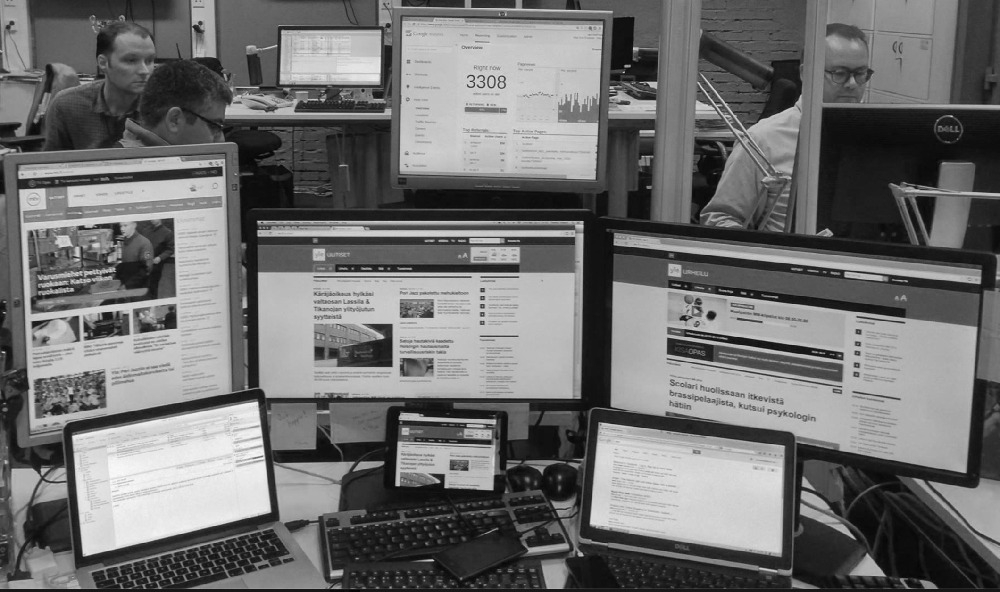
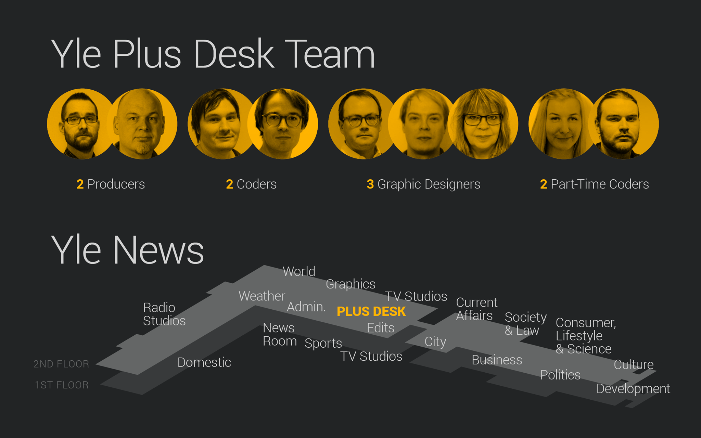
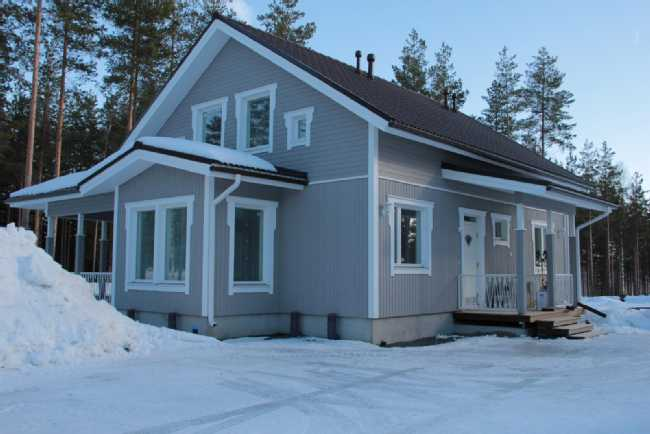

class: center, middle
# Data <span class="highlight">journalismin</span> työvälineenä


Teemo Tebest, <span class="highlight">@teelmo</span>

---

class: left, middle
# Teemo Tebest, Yle

* <span class="highlight">Datajournalisti</span>
* Tausta web-kehittäjänä ja tiedon visualisoinnissa
* Ylen datatiimin perustajajäsen vuodesta 2013

```javascript
require('JS, HTML5, PHP, Python, full-stack, MongoDB, GIS, verkostoanalyysi');
```

* Twitter: <a href="http://twitter.com/teelmo"><span class="highlight">@teelmo</span></a>
* Kotisivu: <a href="teelmo.info"><span class="highlight">teelmo.info</span></a>

---
class: full, middle

<div style="position: absolute; width: 100%; text-align: center; text-shadow: 1px 1px 1px #000;"><h1 style="border:0; text-transform: uppercase;"><span class="highlight">Mitä oikeasti teen</span></h1></div>


---
class: full, middle



---
class: left, middle

# Yle Uutiset: Plusdesk 

* Verkkojuttuja <span class="highlight">yhteistyössä</span> muiden toimitusten kanssa
* Enemmän <span class="highlight">isompia</span> ja <span class="highlight">tutkivampia</span> projekteja, vähemmän päivittäisiä uutisia
* 350 jutusta (2013), 150 juttuun (2016)
* Puolet <span class="highlight">luetuimmista jutuista</span> Ylellä tuli Plusdeskiltä

---
class: left, middle

# Miten onnistua datalla: <span class="highlight">3&nbsp;esimerkkiä</span> + extra

1. <span class="highlight">Eläke</span>laskuri
2. <span class="highlight">Asunto</span>kone
3. <span class="highlight">Kunta</span>tutka
4. <span class="highlight">Yleisöjen</span>ymmärrys

```javascript
if (Motivaatio === true) {
  if (Toteutus === true) {
    return Lopputulos
  }
}
```

---
class: left, middle

# <span class="highlight">Juttu</span> Koska pääset eläkkeelle ja kuinka pitkään

<p><span class="highlight">Motivaatio</span> Eläkeuudistus</p>
<p><span class="highlight">Toteutus</span> Sisällytetty laskuri</p>
<p><span class="highlight">Lopputulos</span> Vuoden 2016 luetuimpia juttuja</p>

<!-- <div style="float: right"><a href="https://docs.google.com/spreadsheets/d/1Gj3uqUzWOUeDGamxc8Ig_Owu-EfZzzs-MaLSLESf0C4/edit#gid=1128173612" target="_blank">» data</a></div><br /> -->
<div style="float: right"><a href="http://yle.fi/uutiset/3-9273402" target="_blank">» juttu</a></div><br />
<!-- <div style="float: right"><a href="https://dashboard.yle.fi/article/3-9273402" target="_blank">» numerot</a></div> -->

---
class: left, middle
# Vuoden 2016 luetuimpia juttuja, <span class="highlight">Miksi?</span>

* Laskuri oli <span class="highlight">sijoitettu artikkelin alkuun</span>
* Laskurissa oli <span class="highlight">oletusarvo</span>
* Helppo käyttää
* Yksinkertainen ja <span class="highlight">&ldquo;yllättävä&rdquo;</span> viesti
* <span class="highlight">Jaettava</span> tulos, yli 80 000 FB-toimintoa
* Hauska &rarr; <span class="highlight">muistettava</span>

---
class: left, middle
# Haasteet / Esteet

* <span class="highlight">Excelistä</span> tarinaksi
* <span class="highlight">Kaksi datasettiä</span> &rarr; olennaisemman valinta
* <span class="highlight">Ymmärrettävä kieli</span> ja termit

---
class: left, middle

# <span class="highlight">Juttu</span> Kuinka suureen asuntoon sinulla on varaa

<p><span class="highlight">Motivaatio</span> Ensiasunnon ostajat</p>
<p><span class="highlight">Toteutus</span> Karttapohjainen sovellus</p>
<p><span class="highlight">Lopputulos</span> Ainutlaatuinen näkökulma asuntomarkkinoihin</p>

<div style="float: right"><a href="https://www.theguardian.com/society/ng-interactive/2015/sep/02/unaffordable-country-where-can-you-afford-to-buy-a-house" target="_blank">» inspiraatio</a></div><br />
<!-- <div style="float: right"><a href="https://docs.google.com/spreadsheets/d/1ZlljAPxWaCHFbhdvpKfoxN3b1an9RniMby60YMNeJQo/edit#gid=1849495620" target="_blank">» data</a></div><br /> -->
<div style="float: right"><a href="http://yle.fi/uutiset/3-8944418" target="_blank">» juttu</a></div><br />
<!-- <div style="float: right"><a href="https://dashboard.yle.fi/article/3-8944418" target="_blank">» numerot</a></div> -->

---
class: left, middle
# Ainutlaatuinen näkökulma asuntomarkkinoihin, <span class="highlight">Miksi?</span>

* Yhdisti asuntojen hintatiedot ihmisten tulotietoihin
* Asunnon koko hinnan sijaan
* Näytti miten kaupungit ja maaseutu eroavat

---
class: left, middle
# Haasteet / Esteet



* Kartat, data ja mobiililaitteet 😡
* Paljon alueita missä ei kauppoja
* Dataa vain osakehuoneistoista, ei omakotitaloja
* Sovellus &harr; <a href="http://yle.fi/uutiset/3-8938636">Uutisjuttu</a>
* Miksi ja mitä jakaisin somessa

---
class: left, middle

# <span class="highlight">Juttu</span> Mikä on kuntasi kunto

<p><span class="highlight">Motivaatio</span> Tulevat vaalit</p>
<p><span class="highlight">Toteutus</span> Kuntatutka</p>
<p><span class="highlight">Lopputulos</span> Noda-Awards -finalisti</p>

<!-- <div style="float: right"><a href="https://docs.google.com/spreadsheets/d/15M_MyAudZXCMASTlbP4SSA3BTQFlw7RRxVwa47uDcEs/edit#gid=0" target="_blank">» data</a></div><br /> -->
<div style="float: right"><a href="http://yle.fi/uutiset/3-9192528" target="_blank">» juttu 1</a> | <a href="http://yle.fi/uutiset/3-9490180" target="_blank">juttu 2</a></div><br />
<!-- <div style="float: right"><a href="https://dashboard.yle.fi/article/3-9192528" target="_blank">» numerot</a></div> -->

---
class: left, middle
# Noda-Awards -finalisti, <span class="highlight">Miksi?</span>

* <span class="highlight">Silmäiltävyys</span> &rarr; <span class="highlight">tarkemmat tiedot</span> halutessa
* <span class="highlight">Personoitu</span> ja <span class="highlight">lähestyttävä</span> toteutus
  * Vaakuna, alaotsikko, taustakartta, katunäkymä, kuntateksti, vaaliteksti
* Kunnat ja yleisö otti palvelun omakseen
* <span class="highlight">Joukkoistimme</span> vaalikoneen kysymyksiä
* <a href="http://yle.fi/uutiset/3-9252893" target="_blank">Data ja prosessi avattiin</a>

---
class: left, middle
# Haasteet / Esteet

* <span class="highlight">Datan hankkiminen</span> nykyisellä kuntajaolla 
* Useiden datalähteiden ja -formaattien yhdistäminen
* Uutta: <span class="highlight">Tilastollisen analyysi</span> ja keskihajonta
* Kuntatekstien yhtenäistäminen ja päivityksien hallinnointi
* <span class="highlight">Viimeistely ja hienosäätö</span>
* Muutokset Googlen rajapintojen käyttörajoissa
* HTTPS:n puute &rarr; Ei automaattista paikannusta 

---
class: center, middle
# <span class="highlight">Extra</span> Yleisöjen ymmärrys

Ylellä on suuri halu ymmärtää yleisöjään ja pyrkimys palvella kaikkia suomalaisia.

---
class: left, middle
# Parempaa mittaamista

* Sivulataukset huono laadun mittari
* Palvelussa käytetty <span class="highlight">kokonaisaika</span> 👍
* Artikkelin <span class="highlight">luettu osuus</span> 👍
* Uutena tulossa: notifikaatit
* Eri mittarit eri palveluissa, eri tiimeissä

Arjessa katsotaan edelleen paljon myös klikkejä, helpompi ymmärtää ja vertailu menneeseen.

---
class: left, middle
# Parempaa reagointia

* A/B-testaus: otsikoissa, sisällöissä
* <a href="http://yle.fi/uutiset/3-7787729" target="_blank">Räätälöidyt mittarit</a>
* <a href="http://yle.fi/uutiset" target="_blank">Chartbeat</a>: taiton tukena
* <a href="https://app.ezyinsights.com/realtime/filter/1471" target="_blank">Ezyinsights</a>: somen ymmärrys
* <a href="https://trends.google.com/trends/explore?geo=FI&q=kuntavaalit" target="_blank">Google Trends</a>: <a href="https://areena.yle.fi/tv/ohjelmat/30-83?t=uusimmat&l=fi" target="_blank">Case nuoret</a>
* <span class="highlight">Data lähelle toimittajaa</span>: <a href="https://dashboard.yle.fi" target="_blank">Dashboard</a> & Päiväraportit

---
class: left, middle
# Journalismi on <span class="highlight">hoksausta 💡</span>

## Data auttaa onnistumaan

* Datalla uudenlaista journalismia
* Datalla ymmärrystä yleisöstä

---
class: center, middle

# Kiitos! <span class="highlight">Kysymyksiä?</span>

<br />

Teemo Tebest, <a href="http://twitter.com/teelmo"><span class="highlight">@teelmo</span></a>