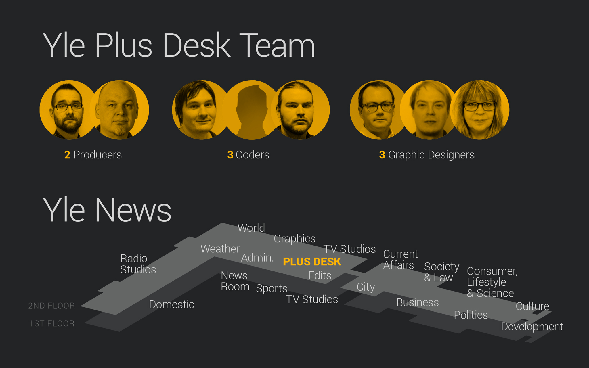

class: center, middle
# There are <span class="highlight">10 kinds</span> of people in this world. 
# <span class="highlight">Those that understand</span> binary and <span class="highlight">those that don’t</span>.

---

class: center, middle
# Datasta visuaaliseksi <span class="highlight">journalismiksi</span></a>


Teemo Tebest, <span class="highlight">@teelmo</span>

---

class: left, middle
# Teemo Tebest, Yle

* <span class="highlight">Datajournalisti</span>, toimittaja, diplomi-insinööri
* Tausta web-kehittäjänä ja tiedon visualisoinnissa
* Ylen datatiimin perustajajäsen vuodesta 2013

```javascript
require('JS, HTML5, PHP, Python, full-stack, MongoDB, GIS, network analysis');
```

* Twitter: <a href="http://twitter.com/teelmo"><span class="highlight">@teelmo</span></a>
* Kotisivu: <a href="teelmo.info"><span class="highlight">teelmo.info</span></a>

---
class: full, middle



---
class: left, middle

# Yle Uutiset: Plusdesk 

* Verkkojuttuja <span class="highlight">yhteistyössä</span> muiden toimitusten kanssa
* Enemmän <span class="highlight">isompia</span> ja <span class="highlight">tutkivampia</span> projekteja, vähemmän päivittäisiä uutisia
* 350 jutusta (2013), 150 juttuun (2017)
* Puolet Ylen <span class="highlight">luetuimmista jutuista</span> tuli Plusdeskiltä

---
class: left, middle

# Käydään läpi keskustellen: <span class="highlight">esimerkkejä</span>

1. <span class="highlight">Eläke</span>laskuri
2. <span class="highlight">Tuki</span>peli
3. <span class="highlight">Fani</span>kone

```javascript
if (Motivation === true) {
  if (Implemantion === true) {
    return Outcome
  }
}
```

---
class: left, middle
# Kuinka monta <span class="highlight">kolmosta</span>?


---

class: left, middle

# <span class="highlight">20</span> kappaletta


---

class: left, middle

# <span class="highlight">Juttu</span> Koska pääset eläkkeelle ja kuinka pitkään

<p><span class="highlight">Motivaatio</span> Eläkeuudistus</p>
<p><span class="highlight">Toteutus</span> Sisällytetty laskuri</p>
<p><span class="highlight">Lopputulos</span> Vuoden 2016 luetuimpia juttuja</p>

<div style="float: right"><a href="https://docs.google.com/spreadsheets/d/1Gj3uqUzWOUeDGamxc8Ig_Owu-EfZzzs-MaLSLESf0C4/edit#gid=1128173612" target="_blank">» data</a></div><br />
<div style="float: right"><a href="http://yle.fi/uutiset/3-9273402" target="_blank">» juttu</a></div><br />
<div style="float: right"><a href="https://dashboard.yle.fi/article/3-9273402" target="_blank">» numerot</a></div><br />
<div style="float: right"><a href="https://www.tyoelake.fi/elakelaskurit/" target="_blank">» Eläketurvakeskuksen versio</a></div>

---
class: left, middle
# Vuoden 2016 luetuimpia juttuja, <span class="highlight">Miksi?</span>

* Laskuri oli <span class="highlight">sijoitettu artikkelin alkuun</span>
* Laskurissa oli <span class="highlight">oletusarvo</span>
* Helppo käyttää
* Yksinkertainen ja <span class="highlight">&ldquo;yllättävä&rdquo;</span> viesti
* <span class="highlight">Jaettava</span> tulos, yli 100 000 FB-toimintoa
* Hauska &rarr; <span class="highlight">muistettava</span>

---
class: left, middle
# Haasteet / Esteet

* <span class="highlight">Excelistä</span> tarinaksi
* <span class="highlight">Kaksi datasettiä</span> &rarr; olennaisemman valinta
* <span class="highlight">Ymmärrettävä kieli</span> ja termit

---
class: left, middle
# Harjoitus

Keksikää mahdollisimman monta tapaa visualisoida luku <span class="highlight">75</span> ja <span class="highlight">37</span>. Hahmotelkaa paperille.

Aikaa <span class="highlight">5 minuuttia</span>

---
class: center, middle
# Joitain <span class="highlight">esimerkkejä</span>


---
class: left, middle
# <span class="highlight">Älä, tee, näin</span>

* <a href="http://livingqlikview.com/the-9-worst-data-visualizations-ever-created/" target="_blank">The 9 Worst Data Visualizations Ever Created</a>

---
class: left, middle

# <span class="highlight">Juttu</span> Vuotesi tukien varassa, pärjäisitkö?

<p><span class="highlight">Motivaatio</span> Asettaa lukija toisen ihmisen asemaan</p>
<p><span class="highlight">Toteutus</span> Tukipeli</p>
<p><span class="highlight">Lopputulos</span> Tavoitettiin nuoria naisia</p>

<div style="float: right"><a href="http://yle.fi/uutiset/3-10509829" target="_blank">» juttu</a></div><br />
<div style="float: right"><a href="https://dashboard.yle.fi/article/3-10509829" target="_blank">» numerot</a></div><br />

---
class: left, middle
# Mitä tapahtuu <span class="highlight">konepellin alla!</span>


<a href="https://www.youtube.com/watch?v=M8qkL_7Lbyw" target="_blank">Ohjelmointi leffoissa vs. ohjemointi oikeasti</a>

---
class: left, middle
# Abraham Wald

* Unkarilainen matemaatikko
* Työskenteli Brittien ilmavoimissa <span class="highlight">toisessa maailmansodassa</span>.
* Miten tehdä <span class="highlight">lentokoneista vastustuskykyisempiä </span> ilmatorjunnalle.

---
class: left, middle
# Abraham Wald
    


---
class: left, middle

# <span class="highlight">Juttu</span> Mitä tai ketä pitäisi kannattaa?

<p><span class="highlight">Motivaatio</span> Jalkapallon MM-kisat</p>
<p><span class="highlight">Toteutus</span> Fanikone&Pelaajakone</p>
<p><span class="highlight">Lopputulos</span> Hyvää oheissisältöä kisoihin</p>

<div style="float: right"><a href="http://yle.fi/uutiset/3-10276815" target="_blank">» juttu1</a></div><br />
<div style="float: right"><a href="http://yle.fi/uutiset/3-10240144" target="_blank">» juttu2</a></div><br />
<div style="float: right"><a href="https://dashboard.yle.fi/article/3-10276815" target="_blank">» numerot1</a></div><br />
<div style="float: right"><a href="https://dashboard.yle.fi/article/3-10240144" target="_blank">» numerot2</a></div><br />

---
class: left, middle
# <span class="highlight">Feature</span>-juttuja

Visuaalinen tarinan kerronta mahdollistaa muotojen (kuva, video, ääni, teksti) yhdistämisen &rarr; <span class="highlight">Kokeilukulttuuri</span>.

* <a href="https://yle.fi/uutiset/3-9853620" target="_blank">Ilmakehätutkimus</a>
* <a href="https://yle.fi/urheilu/3-10204227" target="_blank">Messi</a>

---
class: center, middle

# Kiitos! <span class="highlight">Kysymyksiä?</span>

<br />

Teemo Tebest, <a href="http://twitter.com/teelmo"><span class="highlight">@teelmo</span></a>

<span class="highlight">plus.yle.fi</span>