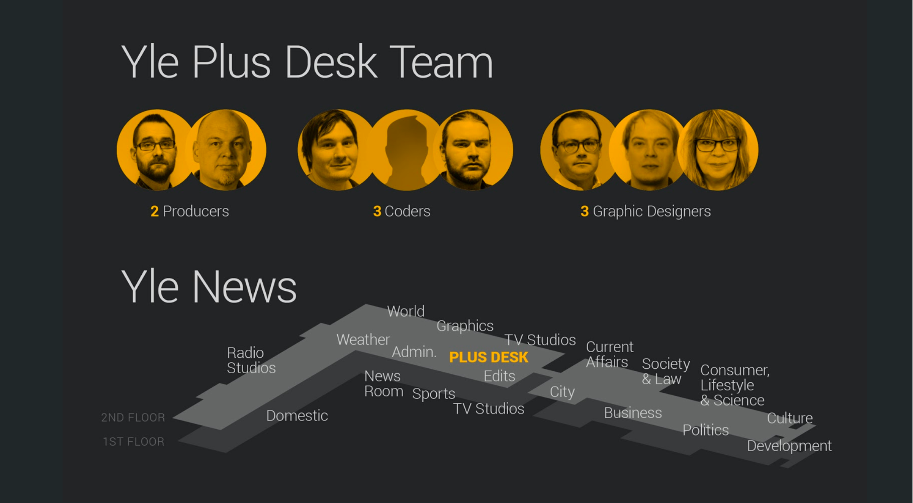
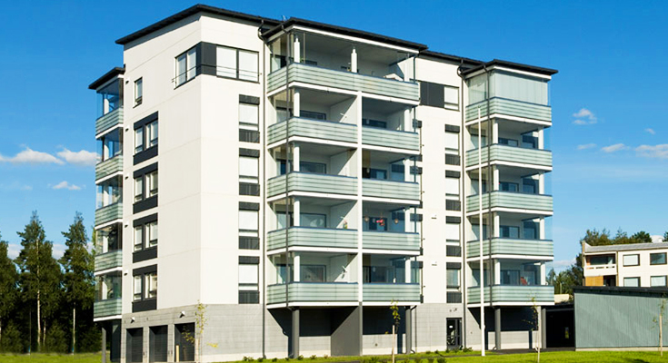

class: center, middle
# There are <span class="highlight">10 kinds</span> of people in this world. 
# <span class="highlight">Those that understand</span> binary and <span class="highlight">those that don’t</span>.

---

class: center, middle
# Yle Akatemia <span class="highlight">Datajournalismi</span>


Teemo Tebest, <span class="highlight">@teelmo</span>

---

class: left, middle
# Teemo Tebest, Yle

* <span class="highlight">Datajournalisti</span>, toimittaja, diplomi-insinööri
* Tausta web-kehittäjänä ja tiedon visualisoinnissa
* Yle Uutisen datatiimin perustajajäsen vuodesta 2013

```javascript
require('JS, HTML5, PHP, Python, full-stack, MongoDB, GIS, network analysis');
```

* Twitter: <a href="http://twitter.com/teelmo"><span class="highlight">@teelmo</span></a>
* Kotisivu: <a href="http://teelmo.info"><span class="highlight">teelmo.info</span></a>
* Blogi: <a href="http://datajournalismi.blogspot.com"><span class="highlight">datajournalismi.blogspot.com</span></a>

---
class: full, middle

<div style="position: absolute; width: 100%; text-align: center; text-shadow: 2px 2px 2px #000;"><h1 style="border:0; text-transform: uppercase;"><span class="highlight">Mitä oikeasti teen</span></h1></div>


---
class: full, middle



---
class: left, middle

# Yle Uutiset: Plus-deski 

* Verkkojuttuja <span class="highlight">yhteistyössä</span> muiden toimitusten kanssa
* Enemmän <span class="highlight">isompia</span> ja <span class="highlight">tutkivampia</span> projekteja, vähemmän päivittäisiä uutisia
* 350 jutusta (2013), 150 juttuun (2018)
* Plus-deski tekee Ylen <span class="highlight">luetuimpia juttuja</span>

---
class: left, middle

# Datajuttuja: <span class="highlight">4&nbsp;esimerkkiä</span>

1. <span class="highlight">Eläke</span>laskuri
2. <span class="highlight">Vaali</span>analyysi
3. <span class="highlight">Asunto</span>kone
4. <span class="highlight">Kunta</span>tutka

```javascript
if (Motivation === true) {
  if (Implemantion === true) {
    return Outcome
  }
}
```

---
class: left, middle

# Ok! valehtelin, paljon enemmän <span class="highlight">esimerkkejä</span>!

Ja te saatte osallistua :)

---
class: left, middle
# Kuinka monta <span class="highlight">kolmosta</span>?


---

class: left, middle

# <span class="highlight">20</span>


---
class: left, middle

# <span class="highlight">Juttu</span> Koska pääset eläkkeelle ja kuinka pitkään

<p><span class="highlight">Motivaatio</span> Eläkeuudistus</p>
<p><span class="highlight">Toteutus</span> Sisällytetty laskuri</p>
<p><span class="highlight">Lopputulos</span> Vuoden 2016 luetuimpia juttuja</p>

<!-- <div style="float: right"><a href="https://docs.google.com/spreadsheets/d/1Gj3uqUzWOUeDGamxc8Ig_Owu-EfZzzs-MaLSLESf0C4/edit#gid=1128173612" target="_blank">» data</a></div><br /> -->
<div style="float: right"><a href="http://yle.fi/uutiset/3-9273402" target="_blank">» story</a></div><br />
<!-- <div style="float: right"><a href="https://dashboard.yle.fi/article/3-9273402" target="_blank">» numbers</a></div> -->

---
class: left, middle
# Vuoden 2016 luetuimpia juttuja, <span class="highlight">Miksi?</span>

* Laskuri oli <span class="highlight">sijoitettu artikkelin alkuun</span>
* Laskurissa oli <span class="highlight">oletusarvo</span>
* Helppo käyttää
* Yksinkertainen ja <span class="highlight">&ldquo;yllättävä&rdquo;</span> viesti
* <span class="highlight">Jaettava</span> tulos, yli 100 000 FB-toimintoa
* Hauska &rarr; <span class="highlight">muistettava</span>

---
class: left, middle
# Haasteet / Esteet

* <span class="highlight">Excelistä</span> tarinaksi
* <span class="highlight">Kaksi datasettiä</span> &rarr; olennaisemman valinta
* <span class="highlight">Ymmärrettävä kieli</span> ja termit

---
class: left, middle
# Toisenlainen laskuri

* <a href="https://yle.fi/uutiset/3-10480550" target="_blank">Verolaskuri</a>

---
class: center, middle

# <span class="highlight">Keep it simple stupid</span>

---
class: center, middle
# <span class="highlight">Huoneentaulu</span>


---
class: left, middle
# <span class="highlight">Juttu</span> Mitä ajattelee uusi valtuustosi

<p><span class="highlight">Motivaatio</span> Kuntavaalit</p>
<p><span class="highlight">Toteutus</span> Vaalianalyysi</p>
<p><span class="highlight">Lopputulos</span> Ainutlaatuinen näkökulma vaalitulokseen</p>

<div style="float: right"><a href="https://vaalikone.yle.fi/kuntavaalit2017/" target="_blank">» data 1</a> / <a href="https://vaalit.yle.fi/tulospalvelu/kv2017" target="_blank">» data 2</a></div><br />
<div style="float: right"><a href="http://yle.fi/uutiset/3-9552923#Tampere" target="_blank">» juttu</a></div><br />
<!-- <div style="float: right"><a href="https://dashboard.yle.fi/article/3-9552923" target="_blank">» numerot</a></div> -->

---
class: left, middle
# Ainutlaatuinen näkökulma vaalitulokseen, <span class="highlight">Miksi?</span>

* Yhdisti tuloksen valittujen mielipiteisiin
* Kommentit toivat sisältöä
* Paikallisen tilanteen vertailu koko maahan

<div style="float: right"><a href="http://yle.fi/uutiset/3-9552930" target="_blank">» toisenlainen vaalijuttu</a></div>

---
class: left, middle
# Haasteet / Esteet

* 17 000 vaalikonevastauksen <span class="highlight">yhdistäminen</span> 9 000 valittuun
* Julkaisu vaaleista <span class="highlight">seuraavana aamuna</span>
* Mielenkiintoisen <span class="highlight">esitystavan</span> löytäminen
* Miksi ja mitä jakaisin somessa

---
class: left, middle
# Harjoitus

Keksikää mahdollisimman monta tapaa visualisoida luku <span class="highlight">75</span> ja <span class="highlight">37</span>. Hahmotelkaa paperille.

Aikaa <span class="highlight">5 minuuttia</span>

---
class: left, middle
# <span class="highlight">Esimerkkejä</span>


---
class: left, middle

# <span class="highlight">Juttu</span> Vuotesi tukien varassa, pärjäisitkö?

<p><span class="highlight">Motivaatio</span> Asettaa lukija toisen ihmisen asemaan</p>
<p><span class="highlight">Toteutus</span> Tukipeli</p>
<p><span class="highlight">Lopputulos</span> Tavoitettiin nuoria naisia</p>

<div style="float: right"><a href="http://yle.fi/uutiset/3-10509829" target="_blank">» juttu</a></div><br />
<!-- <div style="float: right"><a href="https://dashboard.yle.fi/article/3-10509829" target="_blank">» numerot</a></div><br /> -->

---
class: left, middle
# Mitä tapahtuu <span class="highlight">konepellin alla!</span>


<a href="https://www.youtube.com/watch?v=M8qkL_7Lbyw" target="_blank">Ohjelmointi leffoissa vs. ohjemointi oikeasti</a>

---
class: left, middle

# <span class="highlight">Juttu</span> Kuinka suureen asuntoon sinulla on varaa

<p><span class="highlight">Motivaatio</span> Ensiasunnon ostajat</p>
<p><span class="highlight">Toteutus</span> Karttapohjainen sovellus</p>
<p><span class="highlight">Lopputulos</span> Ainutlaatuinen näkökulma asuntomarkkinoihin</p>

<div style="float: right"><a href="https://www.theguardian.com/society/ng-interactive/2015/sep/02/unaffordable-country-where-can-you-afford-to-buy-a-house" target="_blank">» inspiraatio</a></div><br />
<div style="float: right"><a href="https://docs.google.com/spreadsheets/d/1ZlljAPxWaCHFbhdvpKfoxN3b1an9RniMby60YMNeJQo/edit#gid=1849495620" target="_blank">» data</a></div><br />
<div style="float: right"><a href="http://yle.fi/uutiset/3-8944418" target="_blank">» juttu</a></div><br />
<!-- <div style="float: right"><a href="https://dashboard.yle.fi/article/3-8944418" target="_blank">» numerot</a></div> -->

---
class: left, middle
# Ainutlaatuinen näkökulma asuntomarkkinoihin, <span class="highlight">Miksi?</span>

* Yhdisti asuntojen hintatiedot ihmisten tulotietoihin
* Asunnon koko hinnan sijaan
* Näytti miten kaupungit ja maaseutu eroavat

---
class: left, middle
# Haasteet / Esteet



* Kartat, data ja mobiililaitteet 😡
* Paljon alueita missä ei kauppoja
* Dataa vain osakehuoneistoista, ei omakotitaloja
* Sovellus &harr; <a href="http://yle.fi/uutiset/3-8938636">Uutisjuttu</a>
* Miksi ja mitä jakaisin somessa

---
class: left, middle
# <span class="highlight">Älä, tee, näin</span>

* <a href="http://livingqlikview.com/the-9-worst-data-visualizations-ever-created/" target="_blank">The 9 Worst Data Visualizations Ever Created</a>
* <a href="http://getdolphins.com/blog/the-worst-graphs-of-2017/">The Worst Graphs of 2017</a>

---
class: left, middle

# <span class="highlight">Juttu</span> Mikä on kuntasi kunto

<p><span class="highlight">Motivaatio</span> Tulevat vaalit</p>
<p><span class="highlight">Toteutus</span> Kuntatutka</p>
<p><span class="highlight">Lopputulos</span> Noda-Awards -finalisti</p>

<div style="float: right"><a href="https://docs.google.com/spreadsheets/d/15M_MyAudZXCMASTlbP4SSA3BTQFlw7RRxVwa47uDcEs/edit#gid=0" target="_blank">» data</a></div><br />
<div style="float: right"><a href="https://yle.fi/uutiset/3-9490180" target="_blank">» juttu</a></div><br />
<!-- <div style="float: right"><a href="https://dashboard.yle.fi/article/3-9192528" target="_blank">» numerot</a></div> -->

---
class: left, middle
# Noda-Awards -finalisti, <span class="highlight">Miksi?</span>

* <span class="highlight">Silmäiltävyys</span> &rarr; <span class="highlight">tarkemmat tiedot</span> halutessa
* <span class="highlight">Personoitu</span> ja <span class="highlight">lähestyttävä</span> toteutus
  * Vaakuna, alaotsikko, taustakartta, katunäkymä, kuntateksti, vaaliteksti
* Kunnat ja yleisö otti palvelun omakseen
* <span class="highlight">Joukkoistimme</span> vaalikoneen kysymyksiä
* <a href="http://yle.fi/uutiset/3-9252893" target="_blank">Data ja prosessi avattiin</a>

---
class: left, middle
# Haasteet / Esteet

* <span class="highlight">Datan hankkiminen</span> nykyisellä kuntajaolla 
* Useiden datalähteiden ja -formaattien yhdistäminen
* Uutta: <span class="highlight">Tilastollisen analyysi</span> ja keskihajonta
* Kuntatekstien yhtenäistäminen ja päivityksien hallinnointi
* <span class="highlight">Viimeistely ja hienosäätö</span>
* Muutokset Googlen rajapintojen käyttörajoissa
* Teknisiä haasteita

---
class: left, middle
# <span class="highlight">Tähditys</span>

* <a href="https://yle.fi/uutiset/3-10152925" target="_blank">Postinumeropuntari</a>
* <a href="https://yle.fi/uutiset/3-10181489" target="_blank">Koulukone</a>

---
class: left, middle
# Feature juttuja

* <a href="https://yle.fi/uutiset/3-9853620" target="_blank">Kulmala</a>
* <a href="https://yle.fi/urheilu/3-10204227" target="_blank">Messi</a>

---
class: left, middle
# Datavisualisointi <span class="highlight">onnistumisia</span>

* <a href="https://earth.nullschool.net/" target="_blank">A global map of wind</a>
* <a href="https://www.washingtonpost.com/graphics/national/eclipse/?utm_term=.2c9a9e1d3af5&fbclid=IwAR3irhuxh6M6drn9Yy3cVSO4Hq0AqPqVzXI80iFHvNgqSJScnd59qBZRtA4" target="_blank">Here’s every total solar eclipse happening in your lifetime</a>
* <a href="hhttps://www.youtube.com/watch?v=0cODBQqaGTw" target="_blank">A Tornado Hits The Weather Channel</a>
* <a href="https://www.youtube.com/watch?v=-yIHxOui9nQ" target="_blank">How temperature has changed in each country since 1900</a>

---
class: left, middle
# Abraham Wald

* Unkarilainen matemaatikko
* Työskenteli Brittien ilmavoimissa <span class="highlight">toisessa maailmansodassa</span>.
* Miten tehdä <span class="highlight">lentokoneista vastustuskykyisempiä </span> ilmatorjunnalle.

---
class: left, middle
# Abraham Wald
    


---
class: center, middle
# Kiitos! <span class="highlight">Kysymyksiä?</span>

<br />

Teemo Tebest, <a href="http://twitter.com/teelmo"><span class="highlight">@teelmo</span></a>

---
class: left, middle
# <span class="highlight">Plus-deski</span> 

https://plus.yle.fi

