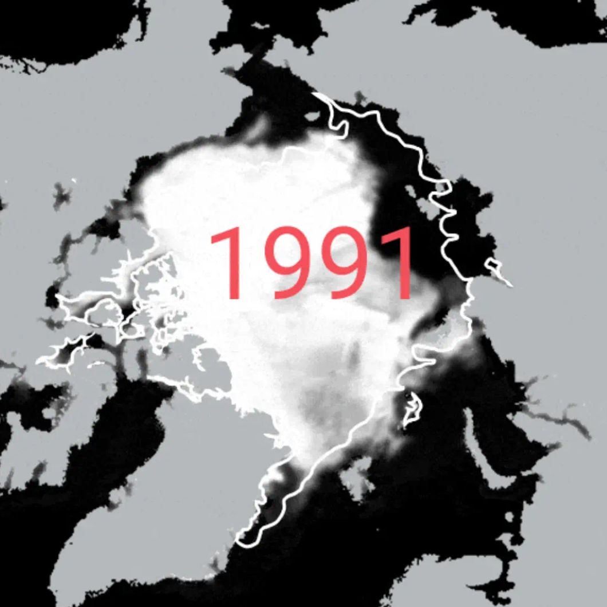
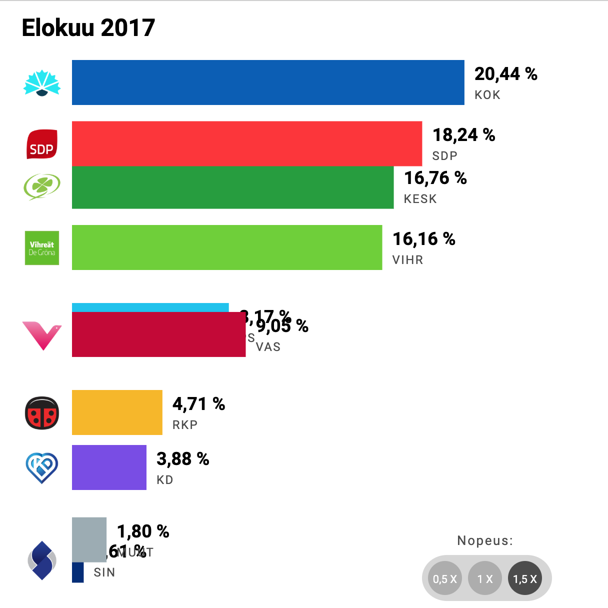
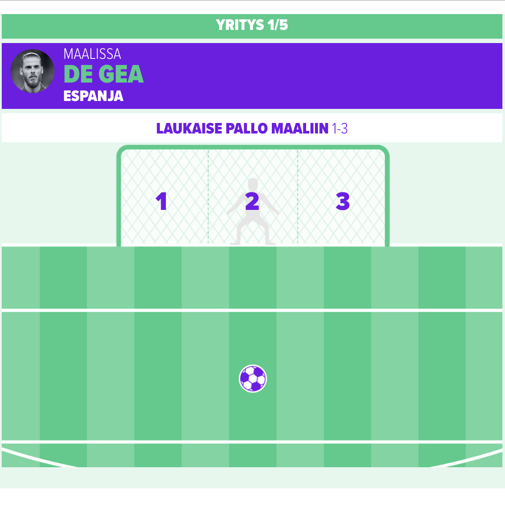
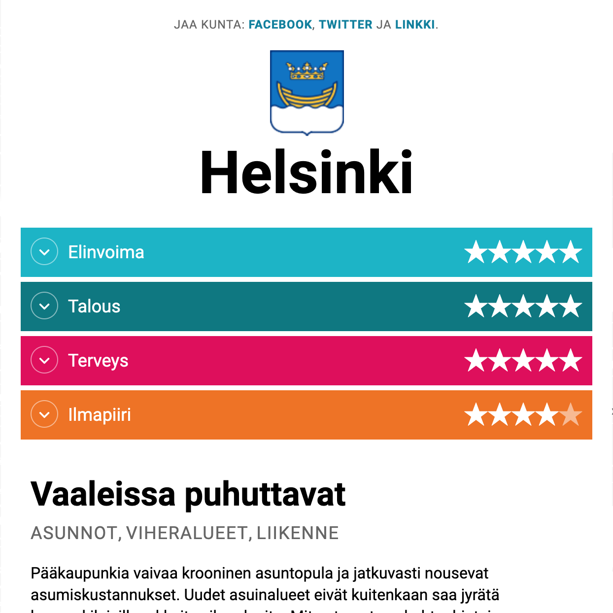
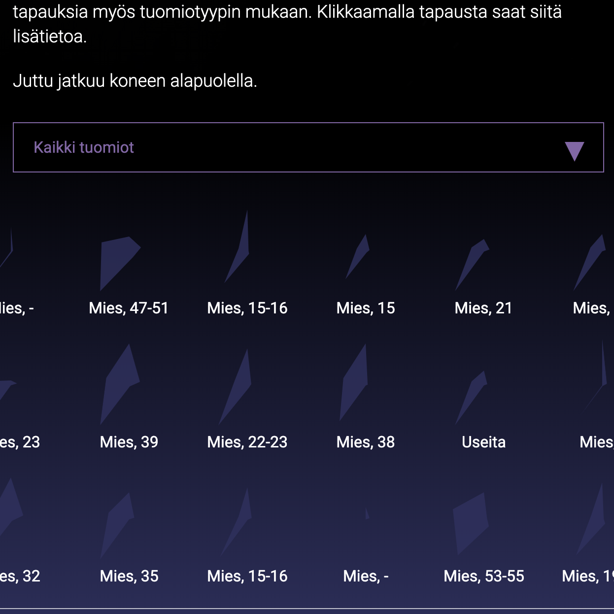

class: left, middle
# Teemo Tebest

* <span class="highlight">Data journalist</span>, lecturer, human
* Master's Degree in IT: Web development, UI/UX&nbsp;design, <span class="highlight">Information visualization</span>
* At <span class="highlight">EBU</span> since mid March. Before at Yle.

```javascript
require('JS, HTML5, PHP, Python, full-stack, MongoDB, GIS, network analysis');
```

* Twitter: <a href="http://twitter.com/teelmo"><span class="highlight">@teelmo</span></a>
* Email: <span class="highlight">tebest@ebu.ch</span>

---

class: center, middle
# EBU and <span class="highlight">data journalism</span>

I'm here to help you catch up with <span class="highlight">online data stories</span>.

<div style="width: 33.3%; float: left; box-sizing: border-box; padding: 2px;"><a href="https://yle.fi/uutiset/3-10595861" target="_blank" style="display: inline-block;"></a></div>
<div style="width: 33.3%; float: left; box-sizing: border-box; padding: 2px;"><a href="https://yle.fi/uutiset/3-10705240" target="_blank" style="display: inline-block;"></a></div>
<div style="width: 33.3%; float: left; box-sizing: border-box; padding: 2px;"><a href="https://yle.fi/urheilu/3-10295932" target="_blank" style="display: inline-block;"></a></div>

---

class: center, middle
# EBU and <span class="highlight">data journalism</span>

<div style="width: 50%; float: left; box-sizing: border-box; padding: 2px;"><a href="https://yle.fi/uutiset/3-9490180#Helsinki" target="_blank" style="display: inline-block;"></a></div>
<div style="width: 50%; float: left; box-sizing: border-box; padding: 2px;"><a href="https://yle.fi/uutiset/3-10665414" target="_blank" style="display: inline-block;"></a></div>

---
class: left, middle
# <span class="highlight">What else?</span>

* <span class="highlight">code and data storage</span> for data journalism
* Data <span class="highlight">visualization templates</span> for the members
* Best practices, introductions, how-tos, etc
* <span class="highlight">Collaborative</span> data projects (climate change?)
* Workshops, meetings, consulting, classes and courses
* How EBU could also provide data and visualizations in <span class="highlight">breaking news</span>

---
class: center, middle
# Thank you! <span class="highlight">Let's do something very cool</span>

<br />

Twitter: <a href="http://twitter.com/teelmo"><span class="highlight">@teelmo</span></a>, Email: <span class="highlight">tebest@ebu.ch</span>