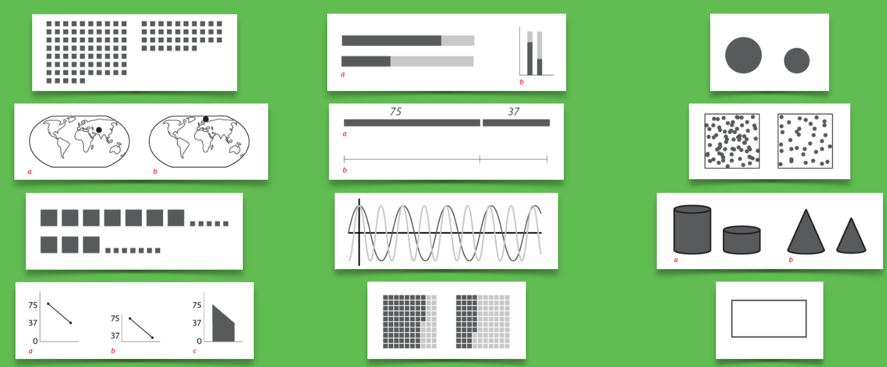

class: full, middle

<div style="position: absolute; width: 100%; text-align: center; text-shadow: 1px 1px 1px #000; top: 30%;">
  <h1 style="border:0; text-transform: uppercase;"><span class="highlight">Teemo Tebest<br />Data Journalist</span></h1>
</div>


---
class: left, middle

# <span class="highlight">Investigation</span> &rarr; A visual <span class="highlight">story</span>

* <span class="highlight">Exercises</span>
* and <span class="highlight">Examples</span>

```javascript
if (Motivation === true) {
  if (Implemantion === true) {
    return Outcome
  }
}
```

---
class: left, middle
# How many <span class="highlight">threes</span>?


---
class: left, middle

# <span class="highlight">20</span>


---
class: left, middle

# <span class="highlight">Story</span> My year living on social welfare

<p><span class="highlight">Motivation</span> To understand the social welfare system</p>
<p><span class="highlight">Implementation</span> An interactive game</p>
<p><span class="highlight">Outcome</span> NODA '19 winner</p>

<div style="float: right"><a href="https://yle.fi/uutiset/3-10509829" target="_blank">» story</a></div><br />
<div style="float: right"><a href="https://dashboard.yle.fi/article/3-10509829" target="_blank">» numbers</a></div><br />

---
class: left, middle
# NODA '19 winner, <span class="highlight">Why?</span>

* The story showed <span class="highlight">how the system works</span> even for those not part of it
* The implemantion succeeded in <span class="highlight">breaking prejudice</span> on people living on welfare
* They didn't just take into account the money but also the quality of life

---
class: left, middle
# Challenges / Obstacles

* The data updates during the process and the different scenarios were <span class="highlight">difficult to handle</span>
* The scenarios were <span class="highlight">debateable</span> even between experts

---
class: left, middle
# Exercise

Make up as many ways to visualize numbers <span class="highlight">75</span> and <span class="highlight">37</span>. Sketch on paper.

<span class="highlight">Take 5 minutes</span>

---
class: left, middle
# <span class="highlight">Examples</span>



---
class: left, middle
# <span class="highlight">Story</span> Hate speech and online shaming

<p><span class="highlight">Motivation</span> Growing hatred on social media</p>
<p><span class="highlight">Implementation</span> Mobile storytelling</p>
<p><span class="highlight">Outcome</span> Reached younger audiences</p>

<div style="float: right"><a href="https://yle.fi/aihe/artikkeli/2019/10/22/luuri-taynna-sontaa-ahdistavia-viesteja-ja-puheluita-tuntemattomista-numeroista" target="_blank">» story</a></div><br />
<div style="float: right"><a href="https://dashboard.yle.fi/article/20-293082" target="_blank">» numbers</a></div>

---
class: left, middle
# Reached younger audiences, <span class="highlight">Why?</span>

* <span class="highlight">The interface</span> makes the story feel more personal
* Everything is based on <span class="highlight">real stories</span>
* The story made visible that the phenomena exists <span class="highlight">outside social media</span>
* The implementation also gives a <span class="highlight">solution</span>

---
class: left, middle
# Challenges / Obstacles

* Publication was <span class="highlight">tied with TV</span>'s schedule; also a positive
* Some elements which were considered had to be removed
* <span class="highlight">Polishing</span> in the story
* To succeed the project had to be done by <span class="highlight">professionals</span> who were motivated

---
class: left, middle
# Data visualizations gone <span class="highlight">wrong</span>

* <a href="http://livingqlikview.com/the-9-worst-data-visualizations-ever-created" target="_blank">The 9 Worst Data Visualizations Ever Created</a>

---
class: left, middle
# Data visualization <span class="highlight">success</span>

* <a href="https://www.youtube.com/watch?v=-yIHxOui9nQ" target="_blank">How temperature has changed in each country since 1900</a>

---
class: left, middle
# One more to pick your brain


---
class: center, middle
# Thank you! <span class="highlight">Questions?</span>

<br />

Teemo Tebest, <a href="http://twitter.com/teelmo"><span class="highlight">@teelmo</span></a>