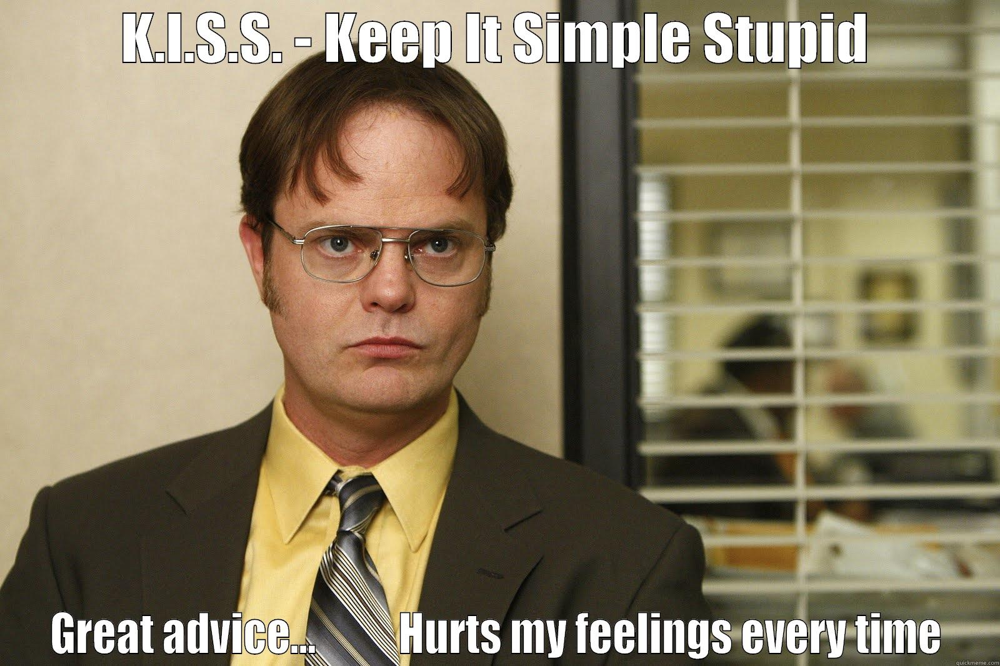

class: center, middle
# There are <span class="highlight">10 kinds</span> of people in this world. 
# <span class="highlight">Those that understand</span> binary and <span class="highlight">those that don’t</span>.

---
class: center, middle
# Edutech <span class="highlight">Datajournalismi</span>


Teemo Tebest, <span class="highlight">@teelmo</span>

---
class: left, middle
# Teemo Tebest, Yle/EBU

* <span class="highlight">Datajournalisti</span>, toimittaja, diplomi-insinööri
* Tausta web-kehittäjänä ja tiedon visualisoinnissa
* Yle Uutisen datatiimin perustajajäsen vuodesta 2013
* Datajournalistina EBU:lla vuodesta 2019

```javascript
require('JS, HTML5, PHP, Python, full-stack, MongoDB, GIS, network analysis');
```

* Twitter &amp; Instagram: <a href="http://twitter.com/teelmo"><span class="highlight">@teelmo</span></a>
* Kotisivu: <a href="http://teelmo.info"><span class="highlight">teelmo.info</span></a>
* Blogi: <a href="http://datajournalismi.blogspot.com"><span class="highlight">datajournalismi.blogspot.com</span></a>

---
class: full, middle

<div style="position: absolute; width: 100%; text-align: center; text-shadow: 2px 2px 2px #000;"><h1 style="border:0; text-transform: uppercase;"><span class="highlight">Mitä siis teen</span></h1></div>


---
class: left, middle

# Mitä <span class="highlight">luvassa</span>

* Ajatusten herättelyä
* <span class="highlight">Esimerkkien</span> kautta

Käydään läpi <span class="highlight">keskustellen</span>

```javascript
if (Motivation === true) {
  if (Implemantion === true) {
    return Outcome
  }
}
```

---
class: left, middle
# Dataa on kyllä…


---
class: left, middle
# Kuinka monta <span class="highlight">kolmosta</span>?


---
class: left, middle

# <span class="highlight">20</span>


---
class: center, middle
# (Data)<span class="highlight">journalistinen</span> ajattelu

Poliitikko 1: "Maahanmuutto on kaksinkertaistunut Suomessa viidessä vuodessa"

---
class: center, middle
# Data on <span class="highlight">numeroita</a>

Poliitikko 1: "Maahanmuutto on <span class="highlight">kaksinkertaistunut</span> Suomessa <span class="highlight">viidessä</span> vuodessa"

---
class: center, middle
# Dataa on <span class="highlight">sanoissa</a>

Poliitikko 1: "<span class="highlight">Maahanmuutto</span> on kaksinkertaistunut <span class="highlight">Suomessa</span> viidessä vuodessa"

---
class: center, middle
# Dataa on <span class="highlight">määreissä</a>

Poliitikko 1: "Maahanmuutto on kaksinkertaistunut Suomessa viidessä <span class="highlight">vuodessa</span>"

---
class: center, middle

## Data &rarr; Informaatio &rarr; Ymmärrys

---
class: left, middle

# Yksi data, <span class="highlight">monta esitystä</a>

Data: <a href="https://climateknowledgeportal.worldbank.org/download-data" target="_blank">World Bank Climate Change Knowledge Portal</a>

* <a href="https://ebuddj.github.io/2021-temperature2/" target="_blank">Globaalisti</a>
* <a href="https://ebuddj.github.io/2021-temperature/" target="_blank">Maittain palkkeina</a>
* <a href="https://ebuddj.github.io/2020-temperature" target="_blank">Maittan kartalla</a>
* <a href="https://ebuddj.github.io/2019-temperature" target="_blank">Dataintensiivisesti</a>

Bonus: <a href="https://raw.githubusercontent.com/ebuddj/2021-polaricecap/main/polaricecap_1979-2021.gif" target="_blank">vaikutukset</a>

---
class: left, middle

# <span class="highlight">Juttu</span> Koska pääset eläkkeelle ja kuinka pitkään

<p><span class="highlight">Motivaatio</span> Eläkeuudistus</p>
<p><span class="highlight">Toteutus</span> Sisällytetty laskuri</p>
<p><span class="highlight">Lopputulos</span> Vuoden 2016 luetuimpia juttuja</p>

<div style="float: right"><a href="https://docs.google.com/spreadsheets/d/1Gj3uqUzWOUeDGamxc8Ig_Owu-EfZzzs-MaLSLESf0C4/edit#gid=1128173612" target="_blank">» data</a></div><br />
<div style="float: right"><a href="https://www.elo.fi/fi-fi/elakkeet-ja-kuntoutus/elakkeelle-ian-perusteella/vanhuuselake" target="_blank">» referenssi</a></div><br />
<div style="float: right"><a href="http://yle.fi/uutiset/3-9273402" target="_blank">» juttu</a></div><br />
<div style="float: right"><a href="https://dashboard.yle.fi/article/3-9273402" target="_blank">» luvut</a></div>

---
class: left, middle
# Vuoden 2016 luetuimpia juttuja, <span class="highlight">Miksi?</span>

* Laskuri oli <span class="highlight">sijoitettu artikkelin alkuun</span>
* Laskurissa oli <span class="highlight">oletusarvo</span>
* Helppo käyttää kaikilla <span class="highlight">laitteilla</span>
* Yksinkertainen ja <span class="highlight">&ldquo;yllättävä&rdquo;</span> viesti
* <span class="highlight">Jaettava</span> tulos, yli 100 000 FB-toimintoa
* Hauska (tunne) &rarr; <span class="highlight">muistettava</span>

---
class: left, middle
# Haasteet / Esteet

* <span class="highlight">Excelistä</span> tarinaksi
* <span class="highlight">Kaksi datasettiä</span> &rarr; olennaisemman valinta
* <span class="highlight">Ymmärrettävä kieli</span> ja termit

---
class: center, middle

# <span class="highlight">Keep it simple stupid</span>



---
class: center, middle
# <span class="highlight">Huoneentaulu</span>


---
class: center, middle
# 5 minuutin <span class="highlight">Tauko</span>

Jatketaan 13:35

<br /><br /><br /><br /><div style="float: right">Jatkossa tarvitaan kynä ja paperia</div><br />

---
class: left, middle
# Harjoitus

Keksikää mahdollisimman monta tapaa visualisoida luku <span class="highlight">75</span> ja <span class="highlight">37</span>. Hahmotelkaa paperille.

Aikaa <span class="highlight">5 minuuttia</span>

---
class: left, middle
# <span class="highlight">Esimerkkejä</span>


---
class: left, middle

# <span class="highlight">Juttu</span> Vuotesi tukien varassa, pärjäisitkö?

<p><span class="highlight">Motivaatio</span> Asettaa lukija toisen ihmisen asemaan</p>
<p><span class="highlight">Toteutus</span> Tukipeli</p>
<p><span class="highlight">Lopputulos</span> Samaistuttavuus</p>

<div style="float: right"><a href="http://yle.fi/uutiset/3-10509829" target="_blank">» juttu</a></div><br />
<!-- <div style="float: right"><a href="https://dashboard.yle.fi/article/3-10509829" target="_blank">» numerot</a></div><br /> -->

---
class: left, middle

# <span class="highlight">Juttu</span> Mikä on kuntasi kunto

<p><span class="highlight">Motivaatio</span> Tulevat vaalit</p>
<p><span class="highlight">Toteutus</span> Kuntatutka</p>
<p><span class="highlight">Lopputulos</span> Noda-Awards -finalisti</p>

<div style="float: right"><a href="https://docs.google.com/spreadsheets/d/15M_MyAudZXCMASTlbP4SSA3BTQFlw7RRxVwa47uDcEs/edit#gid=0" target="_blank">» data</a></div><br />
<div style="float: right"><a href="https://yle.fi/uutiset/3-9490180" target="_blank">» juttu</a></div><br />
<!-- <div style="float: right"><a href ="https://dashboard.yle.fi/article/3-9192528" target="_blank">» numerot</a></div> -->

---
class: left, middle
# Noda-Awards -finalisti, <span class="highlight">Miksi?</span>

* <span class="highlight">Silmäiltävyys</span> &rarr; <span class="highlight">tarkemmat tiedot</span> halutessa
* <span class="highlight">Personoitu</span> ja <span class="highlight">lähestyttävä</span> toteutus
  * Vaakuna, alaotsikko, taustakartta, katunäkymä, kuntateksti, vaaliteksti
* Kunnat ja yleisö otti palvelun omakseen
* <span class="highlight">Joukkoistimme</span> vaalikoneen kysymyksiä
* <a href="http://yle.fi/uutiset/3-9252893" target="_blank">Data ja prosessi avattiin</a>

---
class: left, middle
# Haasteet / Esteet

* <span class="highlight">Datan hankkiminen</span> nykyisellä kuntajaolla 
* Useiden datalähteiden ja -formaattien yhdistäminen
* Uutta: <span class="highlight">Tilastollisen analyysi</span> ja keskihajonta
* Kuntatekstien yhtenäistäminen ja päivityksien hallinnointi
* <span class="highlight">Viimeistely ja hienosäätö</span>
* Muutokset Googlen rajapintojen käyttörajoissa
* Teknisiä haasteita

---
class: left, middle
# <span class="highlight">Tähditys</span>

* <a href="https://yle.fi/uutiset/3-10152925" target="_blank">Postinumeropuntari</a>
* <a href="https://yle.fi/uutiset/3-10181489" target="_blank">Koulukone</a>

---
class: left, middle
# <span class="highlight">Älä, tee, näin</span>

* <a href="http://livingqlikview.com/the-9-worst-data-visualizations-ever-created/" target="_blank">The 9 Worst Data Visualizations Ever Created</a>
* <a href="http://getdolphins.com/blog/the-worst-graphs-of-2017/">The Worst Graphs of 2017</a>

---
class: center, middle
# Kiitos! <span class="highlight">Kysymyksiä?</span>

<br />

Teemo Tebest, <a href="http://twitter.com/teelmo"><span class="highlight">@teelmo</span></a>